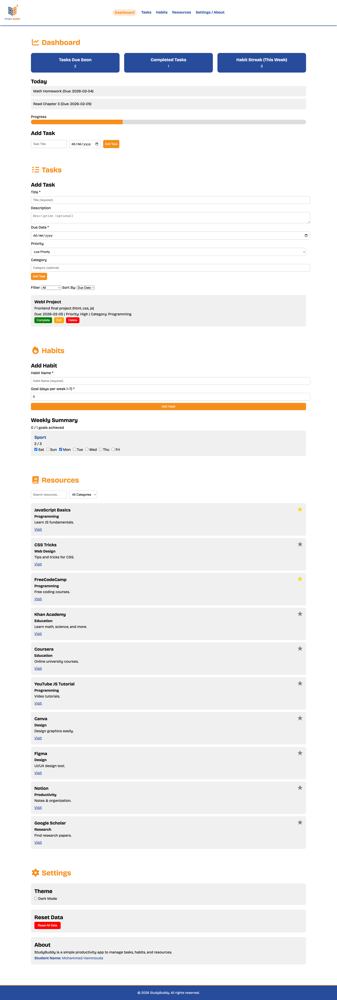

# StudyBuddy SPA

**Student Planner + Habit Tracker + Resources**


## About project
StudyBuddy هو تطبيق ويب من نوع **Single Page Application (SPA)** صممتُه لمساعدة الطلاب على تنظيم مهامهم اليومية، متابعة عاداتهم الأسبوعية، وحفظ الموارد التعليمية المهمة. التطبيق فيه لوحة تحكم تعرض ملخص سريع للتقدم اللي حققناه.

## الميزات
- **Dashboard**:
  - يوضح المهام القريبة والمهام المكتملة.
  - يعرض الـ Habit streak للأسبوع الحالي.
  - قسم "Today" يوضح المهام المستحقة اليوم أو خلال يومين.
  - شريط تقدم يبين نسبة إنجاز المهام.

- **قسم المهام (Tasks)**:
  - CRUD كامل للمهام: إضافة، تعديل، حذف، وعرض.
  - فلترة حسب الحالة (Active / Completed) والفئة.
  - ترتيب المهام حسب الأولوية أو تاريخ الاستحقاق.
  - نموذج يوضح رسائل الخطأ إذا نسيت إدخال بيانات مهمة.
  - كل البيانات مخزنة في `localStorage`.

- **قسم العادات (Habits)**:
  - إضافة عادات جديدة مع تحديد هدف أسبوعي.
  - متابعة كل يوم من أيام الأسبوع باستخدام checkboxes.
  - ملخص أسبوعي يوضح عدد العادات المنجزة.
  - التقدم محفوظ في `localStorage`.

- **قسم الموارد (Resources)**:
  - تحميل الموارد من ملف JSON.
  - البحث والفلترة حسب اسم المورد أو الفئة.
  - وضع الموارد في المفضلة (Favorites) وحفظها.

- **الإعدادات/About**:
  - خيار تغيير الثيم: Light / Dark.
  - زر لإعادة ضبط كل البيانات.
  - وصف التطبيق واسم الطالب.

- **نفذت كل المتطلبات**:
  - التصميم Responsive، يشتغل على الموبايل والكمبيوتر.
  - استخدام Semantic HTML.
  - التنقل بين الأقسام بدون إعادة تحميل الصفحة.
  - دعم كامل لـ Dark Mode.


## كيف أشغله
1. استنساخ المشروع من GitHub:

```bash
git clone https://github.com/mohammedhammouda01/study-buddy-web.git


